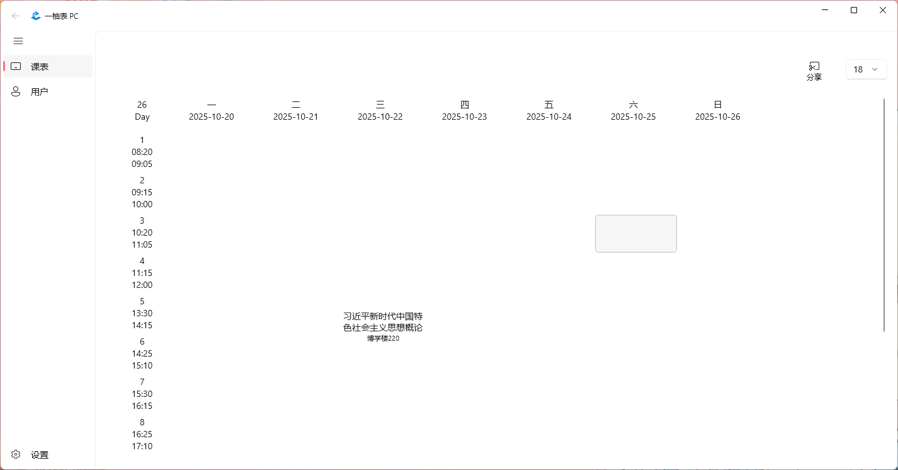

# 一柚表
WinUIKCTab 是一个为 Windows 10 以上设计的课表程序，
旨在帮助用户管理课程表。它提供了课程安排、登录功能以及设置选项等核心功能。

## 计划功能
- [x] 用户登录
- [x] JSON导入
- [x] 课表展示
- [ ] 课程修改
- [x] 周切换
- [ ] 课表性质色盘（用于标识必修课，选修课等）
- [ ] 课程性质修改
- [ ] 课表删除
- [x] 深色模式
- [ ] 主题颜色修改
- [ ] 课表背景图
- [ ] 周编辑
- [ ] 自定义表视图
- [ ] 课表时间轴修改
- [ ] 校园图(标注教学楼以及内部教室的具体信息)
- [ ] 导出报表
### 安装

### 截图(Windows)

## 开源地址📎
项目源码托管在GitHub上，欢迎访问我们的项目页面进行查看和贡献代码。
## 后续的改进
我们计划增加更多的个性化设置选项，以及优化用户体验。
## 贡献者✨
